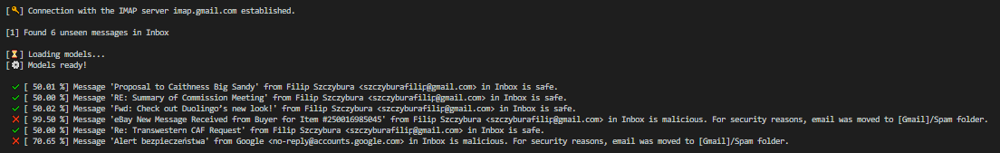

# Integrated phishing(fraud?) detection for IMAP servers
> Email listener, specifically designed for the Gmail IMAP server, automatically identifies incoming phishing emails and moves them to the selected spam folder. 

## Table of Contents
* [General Information](#general-information)
* [Technologies Used](#technologies-used)
* [Features](#features)
* [Screenshots](#screenshots)
* [Setup](#setup)
* [Usage](#usage)
* [Room for Improvement](#room-for-improvement)
* [Contact](#contact)

## General Information
- Phishing is the most prevalent method of cybercrime that convinces people to provide sensitive information; for instance, account IDs, passwords, and bank details. Emails, instant messages, and phone calls are widely used to launch such cyber-attacks. Despite constant updating of the methods of avoiding such cyber-attacks, the ultimate outcome is currently inadequate. On the other hand, phishing emails have increased exponentially in recent years, which suggests a need for more effective and advanced methods to counter them. Numerous methods have been established to filter phishing emails, but the problem still needs a complete solution. 
- The purpose of this project is to use the most recent NLP techniques to identify the patterns indicating malicious character of an email message and take the advantage of machine learning to extract the intrinsic email attributes highly related to the fraud probability. 

## Technologies Used
- Python 3

## Features
- Email listener connecting to any IMAP server (specifically designed for Gmail, might cause issues on different services) searching for unseen emails in the selected mailboxes.
- Reusable implementation to parse .mbox files and email message objects.
- Custom preprocessing pipelines for email feature engineering (extracted text content & message attributes).
- LSTM model classifying email message content as a potential phishing attempt (98.79% accuracy on test data).
- Ensemble model (soft voting) classifying email message characteristics as a potential phishing attempt (98.73% accuracy on test data).
- Automatically allocating malicious emails to the selected spam folder.

## Screenshots

## Setup
Define required environmental & global variables:
- In the .env file define the email server credentials (EMAIL_ADDRESS, APP_PASSWORD) and paths to the models (LSTM_PATH, ENSEMBLE_PATH)
- In the .scripts/main.py script define the IMAP server (IMAP_SERVER), mail boxes to search through (MAIL_BOXES), folder where to move phishing emails (SPAM_BOX) and phishing threshold, above which the emails are treated as phishing (PHISHY_THRESHOLD).

## Usage
1. Run ./scripts/main.py
2. If MAIL_BOXES or SPAM_BOX are empty, user is prompted to select mailbox(es) from the console.

## Room for Improvement
To accomplish this project, three text corpuses were used for machine learning: 
* The first dataset was a phishing email corpus, where every email is a reported and verified phishing attempt: https://www.kaggle.com/datasets/oakent/phishing-emails-mbox
* The second dataset was an email corpus containing legitimate messages from the Enron company. I took the advantage of already converted Enron mbox dataset from [@degoocampoh]: https://github.com/diegoocampoh/MachineLearningPhishing/blob/master/code/resources/emails-enron.mbox
* The third dataset was a csv containing labeled email messages content from Kaggle https://www.kaggle.com/code/kerneler/starter-fraud-email-datasets-46b38b81-0/data

Although both the LSTM and ensemble models perform very accurately on the test data (98.76%), the algorithms are very likely to be underfitted in terms of actual incoming emails. For further improvement, algorithms could be trained for a greater extent on more datasets from the online archive https://monkey.org/~jose/phishing/ - especially ones younger than 2015, as it is contineously updated with new, hand-classified phishing emails. On the other hand, additional production-environment data should be fed to the algorithms, in order to make this project highly applicable and accurate in real life.

## Contact
Created by [@Svantevith] - feel free to contact me via LinkedIn https://pl.linkedin.com/in/szczyburafilip
